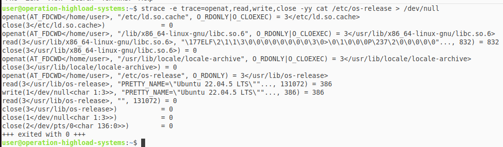

# Linux Архитектура и файловые системы

---

## Задание 1. Kernel and Module Inspection

* продемонстрировать версию ядра ОС
* показать все загруженные модули ядра
* отключить автозагрузку модуля cdrom
* найти и описать конфигурацию ядра (файл конфигурации, параметр CONFIG_XFS_FS)

--- 

Команда ```cat /proc/version``` выводит следующее

```txt
Linux version 6.8.0-90-generic (buildd@lcy02-amd64-082) (x86_64-linux-gnu-gcc-12 (Ubuntu 12.3.0-1ubuntu1~22.04.2) 12.3.0, GNU ld (GNU Binutils for Ubuntu) 2.38) #91~22.04.1-Ubuntu SMP PREEMPT_DYNAMIC Thu Nov 20 15:20:45 UTC 2
```

Таким образом нахожу что версия ядра -- `6.8.0-90-generic` (также можно получить по команде `uname -r`)

--- 

Показываю все загружаемые модули ядра с помощью команды ```lsmod```

```txt
Module                  Size  Used by
nfnetlink              20480  0
intel_rapl_msr         20480  0
intel_rapl_common      40960  1 intel_rapl_msr
intel_uncore_frequency_common    16384  0
intel_pmc_core        118784  0
intel_vsec             20480  1 intel_pmc_core
pmt_telemetry          16384  1 intel_pmc_core
pmt_class              12288  1 pmt_telemetry
crct10dif_pclmul       12288  1
polyval_clmulni        12288  0
polyval_generic        12288  1 polyval_clmulni
binfmt_misc            24576  1
ghash_clmulni_intel    16384  0
sha256_ssse3           32768  0
sha1_ssse3             32768  0
aesni_intel           356352  0
crypto_simd            16384  1 aesni_intel
nls_iso8859_1          12288  1
snd_intel8x0           53248  2
snd_ac97_codec        196608  1 snd_intel8x0
cryptd                 24576  2 crypto_simd,ghash_clmulni_intel
ac97_bus               12288  1 snd_ac97_codec
snd_pcm               192512  2 snd_intel8x0,snd_ac97_codec
joydev                 32768  0
rapl                   20480  0
snd_seq_midi           24576  0
snd_seq_midi_event     16384  1 snd_seq_midi
input_leds             12288  0
snd_rawmidi            57344  1 snd_seq_midi
serio_raw              20480  0
snd_seq               118784  2 snd_seq_midi,snd_seq_midi_event
snd_seq_device         16384  3 snd_seq,snd_seq_midi,snd_rawmidi
snd_timer              49152  2 snd_seq,snd_pcm
snd                   143360  11 snd_seq,snd_seq_device,snd_intel8x0,snd_timer,snd_ac97_codec,snd_pcm,snd_rawmidi
soundcore              16384  1 snd
mac_hid                12288  0
vboxguest              57344  0
sch_fq_codel           24576  2
vmwgfx                454656  3
drm_ttm_helper         12288  1 vmwgfx
ttm                   110592  2 vmwgfx,drm_ttm_helper
msr                    12288  0
parport_pc             53248  0
ppdev                  24576  0
lp                     28672  0
parport                73728  3 parport_pc,lp,ppdev
efi_pstore             12288  0
ip_tables              32768  0
x_tables               65536  1 ip_tables
autofs4                57344  2
crc32_pclmul           12288  0
ahci                   49152  2
psmouse               217088  0
libahci                53248  1 ahci
i2c_piix4              32768  0
e1000                 180224  0
pata_acpi              12288  0
video                  77824  0
wmi                    28672  1 video
hid_generic            12288  0
usbhid                 77824  0
hid                   180224  2 usbhid,hid_generic
```

Модуль `cdrom` и так не загружен в системе (пустой вывод по команде `lsmod | grep cdrom`)

Поэтому я выбрал другой относительно бесполезный модуль, 
который не влияет на работу системы, а именно ```joydev``` -- модуль для геймпадов

Сделал я это через включение в черный список данного модуля:

```shell
root@Operation-of-Highload-Systems:~# cd /etc/modprobe.d/
root@Operation-of-Highload-Systems:/etc/modprobe.d# ls
alsa-base.conf                  blacklist.conf              blacklist-modem.conf         intel-microcode-blacklist.conf
amd64-microcode-blacklist.conf  blacklist-firewire.conf     blacklist-oss.conf           iwlwifi.conf
blacklist-ath_pci.conf          blacklist-framebuffer.conf  blacklist-rare-network.conf
root@Operation-of-Highload-Systems:/etc/modprobe.d# sudo nano blacklist-joydev.conf
root@Operation-of-Highload-Systems:/etc/modprobe.d# cat blacklist-joydev.conf
blacklist joydev
root@Operation-of-Highload-Systems:/etc/modprobe.d# update-initramfs -u
update-initramfs: Generating /boot/initrd.img-6.8.0-90-generic
```

Далее перезапускаю систему (```reboot```) и проверяю наличие модуля ```joydev``` с помощью команды ```lsmod```:

```shell
admin1@Operation-of-Highload-Systems:~$ lsmod | grep joydev
```

Пустой вывод означает, что метод с блэклистом рабочий и впредь данный модуль не будет загружаться при старте системы вовсе

---

Найти и описать конфигурацию ядра:

- Конфиги ядра и старта находятся в каталоге ```/boot```
- Версия ядра ```6.8.0-90-generic``` так что следует заходить в соответствующий файл

```shell
root@Operation-of-Highload-Systems:/boot# ls -l
total 198192
-rw-r--r-- 1 root root   287007 иÑл 30  2024 config-6.8.0-40-generic
-rw-r--r-- 1 root root   287202 Ñен 19 17:46 config-6.8.0-90-generic
drwx------ 3 root root     4096 Ñнв  1  1970 efi
drwxr-xr-x 6 root root     4096 Ð¾ÐºÑ  2 00:59 grub
lrwxrwxrwx 1 root root       27 Ð¾ÐºÑ  2 00:58 initrd.img -> initrd.img-6.8.0-90-generic
-rw-r--r-- 1 root root 77202438 Ð¾ÐºÑ  2 16:48 initrd.img-6.8.0-40-generic
-rw-r--r-- 1 root root 77300408 Ð¾ÐºÑ 12 23:51 initrd.img-6.8.0-90-generic
lrwxrwxrwx 1 root root       27 Ð¾ÐºÑ  2 00:48 initrd.img.old -> initrd.img-6.8.0-40-generic
-rw-r--r-- 1 root root   182800 Ñ
                                 ев  6  2022 memtest86+.bin
-rw-r--r-- 1 root root   184476 Ñ
                                 ев  6  2022 memtest86+.elf
-rw-r--r-- 1 root root   184980 Ñ
                                 ев  6  2022 memtest86+_multiboot.bin
-rw------- 1 root root  8654773 иÑл 30  2024 System.map-6.8.0-40-generic
-rw------- 1 root root  8709634 Ñен 19 17:46 System.map-6.8.0-90-generic
lrwxrwxrwx 1 root root       24 Ð¾ÐºÑ  2 00:58 vmlinuz -> vmlinuz-6.8.0-90-generic
-rw-r--r-- 1 root root 14928264 Ñен 11  2024 vmlinuz-6.8.0-40-generic
-rw------- 1 root root 14985608 Ñен 19 17:46 vmlinuz-6.8.0-90-generic
lrwxrwxrwx 1 root root       24 Ð¾ÐºÑ  2 00:58 vmlinuz.old -> vmlinuz-6.8.0-40-generic
root@Operation-of-Highload-Systems:/boot# cat config-6.8.0-90-generic | grep CONFIG_XFS_FS
CONFIG_XFS_FS=m
```

Итого: видно, что значение ```CONFIG_XFS_FS = m```, что означает, что система поддерживает файловую систему ```XFS```
как загружаемый модуль

---

## Задание 2. Наблюдение за VFS

* Используйте `strace` для анализа команды `cat /etc/os-release > /dev/null`.

  * Для этого запустите `strace -e trace=openat,read,write,close cat/etc/os-release > /dev/null`

* Описать открываемый и читаемый файл, объяснить отсутствие записывающих вызовов в выводе.

---

Файл `/etc/os-release` - системный файл, содержащий идентификационную информацию об операционной системе 
(например, название дистрибутива, версию, идентификатор, и т.д.).

Результат выполнения команды `strace -e trace=openat,read,write,close -yy cat /etc/os-release > /dev/null` следующий:

```shell
user@operation-highload-systems:~$ strace -e trace=openat,read,write,close -yy cat /etc/os-release > /dev/null
openat(AT_FDCWD</home/user>, "/etc/ld.so.cache", O_RDONLY|O_CLOEXEC) = 3</etc/ld.so.cache>
close(3</etc/ld.so.cache>)              = 0
openat(AT_FDCWD</home/user>, "/lib/x86_64-linux-gnu/libc.so.6", O_RDONLY|O_CLOEXEC) = 3</usr/lib/x86_64-linux-gnu/libc.so.6>
read(3</usr/lib/x86_64-linux-gnu/libc.so.6>, "\177ELF\2\1\1\3\0\0\0\0\0\0\0\0\3\0>\0\1\0\0\0P\237\2\0\0\0\0\0"..., 832) = 832
close(3</usr/lib/x86_64-linux-gnu/libc.so.6>) = 0
openat(AT_FDCWD</home/user>, "/usr/lib/locale/locale-archive", O_RDONLY|O_CLOEXEC) = 3</usr/lib/locale/locale-archive>
close(3</usr/lib/locale/locale-archive>) = 0
openat(AT_FDCWD</home/user>, "/etc/os-release", O_RDONLY) = 3</usr/lib/os-release>
read(3</usr/lib/os-release>, "PRETTY_NAME=\"Ubuntu 22.04.5 LTS\""..., 131072) = 386
write(1</dev/null<char 1:3>>, "PRETTY_NAME=\"Ubuntu 22.04.5 LTS\""..., 386) = 386
read(3</usr/lib/os-release>, "", 131072) = 0
close(3</usr/lib/os-release>)           = 0
close(1</dev/null<char 1:3>>)           = 0
close(2</dev/pts/0<char 136:0>>)        = 0
+++ exited with 0 +++
```



Нет записывающих вызовов в `shell`, т.к. стандартный вывод перенаправлен в `/dev/null`.

---

## Задание 3. LVM Management

* Добавить к своей виртуальной машине диск /dev/sdb размером 2GB.

* Создать раздел на /dev/sdb, используя fdisk или parted.

* Создать Physical Volume (PV) на этом разделе.

* Создать Volume Group (VG) с именем vg_highload.

* Создать два Logical Volume (LV): data_lv (1200 MiB) и logs_lv (оставшееся место).

* Отформатировать data_lv как ext4 и примонтировать в /mnt/app_data.

* Отформатировать logs_lv как xfs и примонтировать в /mnt/app_logs.

---

После добавления диска к виртуальной машине (через настройку ВМ в VirtualBox) его можно найти в выводе команды `lsblk`:

```text
user@operation-highload-systems:~$ lsblk
NAME   MAJ:MIN RM   SIZE RO TYPE MOUNTPOINTS
loop0    7:0    0  74,3M  1 loop /snap/core22/1612
loop1    7:1    0     4K  1 loop /snap/bare/5
loop2    7:2    0 505,1M  1 loop /snap/gnome-42-2204/176
loop3    7:3    0 271,2M  1 loop /snap/firefox/4848
loop4    7:4    0  91,7M  1 loop /snap/gtk-common-themes/1535
loop5    7:5    0  12,9M  1 loop /snap/snap-store/1113
loop6    7:6    0  38,8M  1 loop /snap/snapd/21759
loop7    7:7    0  50,9M  1 loop /snap/snapd/25577
loop8    7:8    0   500K  1 loop /snap/snapd-desktop-integration/178
sda      8:0    0    25G  0 disk 
|-sda1   8:1    0     1M  0 part 
|-sda2   8:2    0   513M  0 part /boot/efi
`-sda3   8:3    0  24,5G  0 part /
sdb      8:16   0     2G  0 disk 
sr0     11:0    1  1024M  0 rom
```

Соответственно созданный диск в `2GB` называется `sdb`

---

Создаю раздел с помощью команд:

```txt
sudo parted /dev/sdb mklabel gpt
sudo parted /dev/sdb mkpart primary 0% 100%
sudo parted /dev/sdb set 1 lvm on
```

Далее создаю PV, VG, LV (data_lv), LV (logs_lv); вывод в терминале:

```txt
user@operation-highload-systems:~$ sudo partprobe /dev/sdb
user@operation-highload-systems:~$ sudo pvcreate /dev/sdb1
  Physical volume "/dev/sdb1" successfully created.
user@operation-highload-systems:~$ sudo vgcreate vh_highload /dev/sdb1
  Volume group "vh_highload" successfully created
user@operation-highload-systems:~$ sudo lvcreate -L 1200MiB -n data_lv vh_highload
  Logical volume "data_lv" created.
user@operation-highload-systems:~$ sudo lvcreate -l 100%FREE -n logs_lv vh_highload
  Logical volume "logs_lv" created.
```

---

Форматирование `data_lv` и `logs_lv`:

```txt
user@operation-highload-systems:~$ sudo mkfs.ext4 /dev/vh_highload/data_lv
mke2fs 1.46.5 (30-Dec-2021)
Creating filesystem with 307200 4k blocks and 76800 inodes
Filesystem UUID: 52d5760f-4cf3-428f-b005-08eb45d4b9a6
Superblock backups stored on blocks: 
 32768, 98304, 163840, 229376, 294912

Allocating group tables: done                            
Writing inode tables: done                            
Creating journal (8192 blocks): done
Writing superblocks and filesystem accounting information: done

user@operation-highload-systems:~$ sudo mkfs.xfs /dev/vh_highload/logs_lv
meta-data=/dev/vh_highload/logs_lv isize=512    agcount=4, agsize=54016 blks
         =                       sectsz=512   attr=2, projid32bit=1
         =                       crc=1        finobt=1, sparse=1, rmapbt=0
         =                       reflink=1    bigtime=0 inobtcount=0
data     =                       bsize=4096   blocks=216064, imaxpct=25
         =                       sunit=0      swidth=0 blks
naming   =version 2              bsize=4096   ascii-ci=0, ftype=1
log      =internal log           bsize=4096   blocks=1566, version=2
         =                       sectsz=512   sunit=0 blks, lazy-count=1
realtime =none                   extsz=4096   blocks=0, rtextents=0
```

Далее:

```txt
user@operation-highload-systems:~$ sudo mkdir -p /mnt/app_data /mnt/app_logs
user@operation-highload-systems:~$ sudo mount /dev/vh_highload/data_lv /mnt/app_data
user@operation-highload-systems:~$ sudo mount /dev/vh_highload/logs_lv /mnt/app_logs
```

Как результат из вывода `lsblk`:

```txt
sdb                       8:16   0     2G  0 disk 
`-sdb1                    8:17   0     2G  0 part 
  |-vh_highload-data_lv 252:0    0   1,2G  0 lvm  /mnt/app_data
  `-vh_highload-logs_lv 252:1    0   844M  0 lvm  /mnt/app_logs
```

---

## Задание 4. Использование pseudo filesystem

* Извлечь из /proc модель CPU и объём памяти (KiB).

* Используя /proc/\$\$/status, найдите Parent Process ID (PPid) вашего текущего shell. что означает $$ ?

* Определить настройки I/O scheduler для основного диска /dev/sda.

* Определить размер MTU для основного сетевого интерфейса (например, eth0 или ens33).

---

Найдем данные по командам:

```txt
user@operation-highload-systems:~$ grep "model name" /proc/cpuinfo | head -1
model name : 12th Gen Intel(R) Core(TM) i7-12800H

user@operation-highload-systems:~$ grep "MemTotal" /proc/meminfo
MemTotal:        4009664 kB

user@operation-highload-systems:~$ grep "PPid" /proc/$$/status
PPid: 2146

user@operation-highload-systems:~$ cat /sys/block/sda/queue/scheduler
none [mq-deadline] 

user@operation-highload-systems:~$ cat /sys/class/net/enp0s3/mtu
1500
```

Тогда:

* CPU: 12th Gen Intel(R) Core(TM) i7-12800H
* Память: 4009664 KiB
* PPid для shell: 2146. $$ - это process id для shell (в котором выполняются текущие команды)
* Настройки I/O scheduler: none [md-deadline]
* Размер MTU для основного сетевого интерфейса: 1500

---
