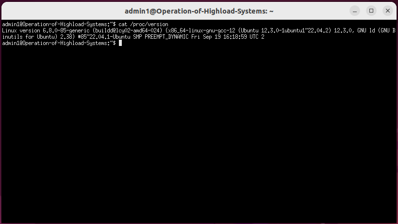

# Linux Архитектура и файловые системы

## Задание 1. Kernel and Module Inspection

--- 

Команда ```cat /proc/version``` выводит следующее



Таким образом нахожу что версия ядра -- Linux version 6.8.0.85-generic

--- 

Показываю все загружаемые модули ядра с помощью команды ```lsmod```

```txt

Module                  Size  Used by
intel_rapl_msr         20480  0
intel_rapl_common      40960  1 intel_rapl_msr
intel_uncore_frequency_common    16384  0
intel_pmc_core        118784  0
intel_vsec             20480  1 intel_pmc_core
pmt_telemetry          16384  1 intel_pmc_core
pmt_class              12288  1 pmt_telemetry
binfmt_misc            24576  1
crct10dif_pclmul       12288  1
polyval_clmulni        12288  0
polyval_generic        12288  1 polyval_clmulni
ghash_clmulni_intel    16384  0
sha256_ssse3           32768  0
nls_iso8859_1          12288  1
snd_intel8x0           53248  2
snd_ac97_codec        196608  1 snd_intel8x0
sha1_ssse3             32768  0
aesni_intel           356352  0
ac97_bus               12288  1 snd_ac97_codec
crypto_simd            16384  1 aesni_intel
snd_pcm               192512  2 snd_intel8x0,snd_ac97_codec
cryptd                 24576  2 crypto_simd,ghash_clmulni_intel
rapl                   20480  0
snd_seq_midi           24576  0
input_leds             12288  0
joydev                 32768  0
snd_seq_midi_event     16384  1 snd_seq_midi
serio_raw              20480  0
snd_rawmidi            57344  1 snd_seq_midi
snd_seq               118784  2 snd_seq_midi,snd_seq_midi_event
snd_seq_device         16384  3 snd_seq,snd_seq_midi,snd_rawmidi
snd_timer              49152  2 snd_seq,snd_pcm
mac_hid                12288  0
snd                   143360  11 snd_seq,snd_seq_device,snd_intel8x0,snd_timer,snd_ac97_codec,snd_pcm,snd_rawmidi
soundcore              16384  1 snd
vboxguest              57344  0
sch_fq_codel           24576  2
vmwgfx                454656  2
drm_ttm_helper         12288  1 vmwgfx
ttm                   110592  2 vmwgfx,drm_ttm_helper
msr                    12288  0
parport_pc             53248  0
ppdev                  24576  0
lp                     28672  0
parport                73728  3 parport_pc,lp,ppdev
efi_pstore             12288  0
ip_tables              32768  0
x_tables               65536  1 ip_tables
autofs4                57344  2
crc32_pclmul           12288  0
ahci                   49152  2
psmouse               217088  0
libahci                53248  1 ahci
i2c_piix4              32768  0
video                  77824  0
wmi                    28672  1 video
e1000                 180224  0
pata_acpi              12288  0
hid_generic            12288  0
usbhid                 77824  0
hid                   180224  2 usbhid,hid_generic

```

---


